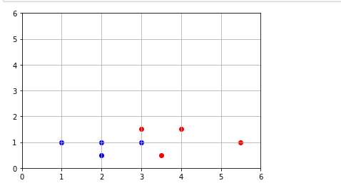
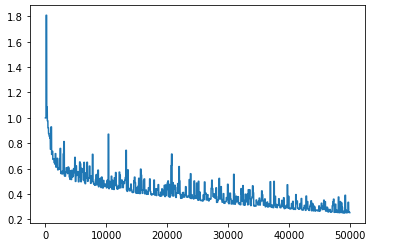

Implemented a neural network from scratch. 
Took some data points for training and classified the input point given as blue or red flower.
Trained the network using two inputs and random weights and bias.
The model predicted the new flower as red or blue with around 98% accuracy.

Here is the scatter plot of the points I used for training the model.

The cost graph of different training points. 

Technology Stack 

=> Python

Libraries used 

=> NumPy

=>Matplotlib